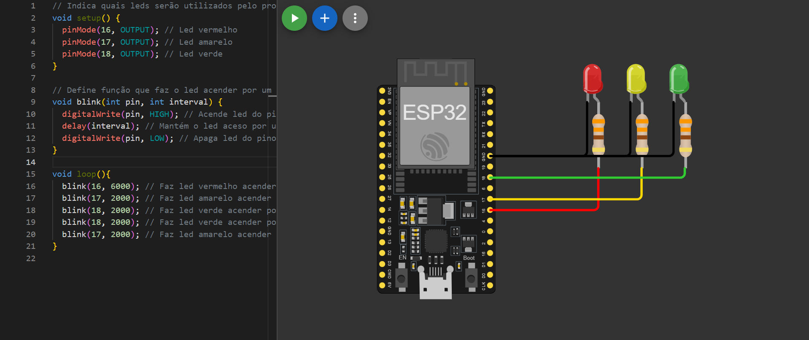
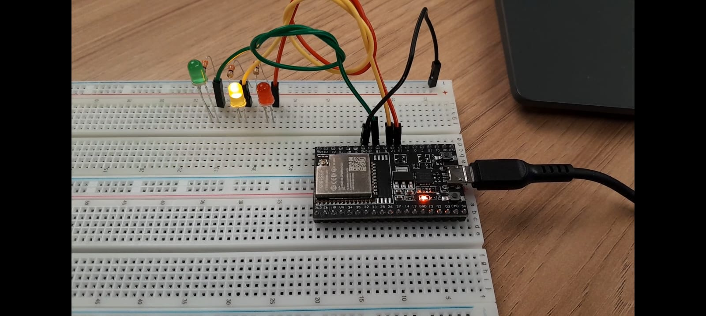

# Ponderada Semáforo Offline

## Objetivos
Como objetivo desta ponderada, tem-se a elaboração e montagem de um circuito que simule o funcionamento de semáforo que funcione sem a necessidade de conexão com rede. Sendo assim, os objetivos específicos incluem:
- Elaboração de código para placa ESP32 que controle um com que um conjunto de leds seguindo um padrão estabelecido;
- Simulação de circuito para aplicação do código desenvolvido; e
- Construção de protótipo físico para o sistema;

## Solução

### Montagem Física

Antes de iniciar a montagem física do circuito, foi elaborada uma simulação contendo os mesmos componentes que a versão final teria, com o objetivo de testar o seu funcionamento e averiguar a efetividade do código construído.

Sendo assim, a Figura 1 traz uma ilustração da simulação do circuito feito no simulador Wokwi:

<div align='center'>
<sup>Figura 1 - Simulação do circuito no Wokwi</sup>



<sup>Fonte: Material produzido pelo autor (2024)</sup>
</div>

A simulação anterior permitiu melhor visualização de como deveria ocorrer a montagem e a integração dos componentes junto à placa em questão. A parir disso, foi possível a construção de um protótipo físico capaz condizente com aquele simulado.

Nesse sentido, a Figura 2 apresenta a montagem física do circuito anterior, utilizando uma _protoboard_ para facilitar as ligações elétricas:

<div align='center'>
<sup>Figura 2 - Montagem física do circuito</sup>



<sup>Fonte: Material produzido pelo autor (2024)</sup>
</div>

### Código

Com o circuito montado, visando cumprir com os objetivos anteriores, construiu-se o código disponível no aquivo [`semaforo.ino`](semaforo.ino), também apresentado seguir:

``` C++
// Indica quais leds serão utilizados pelo programa
void setup() {
  pinMode(16, OUTPUT); // Led vermelho
  pinMode(17, OUTPUT); // Led amarelo
  pinMode(18, OUTPUT); // Led verde
}

// Define função que faz o led acender por um intervalo determinado e depois apagar
void blink(int pin, int interval) { 
  digitalWrite(pin, HIGH); // Acende led do pino determinado
  delay(interval); // Mantém o led aceso por um intervalo determinado
  digitalWrite(pin, LOW); // Apaga led do pino determinado
}

void loop(){
  blink(16, 6000); // Faz led vermelho acender por 6 segundos
  blink(17, 2000); // Faz led amarelo acender por 2 segundos
  blink(18, 2000); // Faz led verde acender por 2 segundos
  blink(18, 2000); // Faz led verde acender por mais 2 segundos (simulando um tempo adicional para pedestres terminarem a travessia)
  blink(17, 2000); // Faz led amarelo acender por 2 segundos
}
```

O upload do _snippet_ anterior foi feito por meio da Arduino IDE, na Figura 3, pode-se observar a interface dessa IDE:

<div align='center'>
<sup>Figura 3 - Código na Arduino IDE</sup>


<sup>Fonte: Material produzido pelo autor (2024)</sup>
</div>

## Resultados
Os resultados da aplicação do código anterior estão expostos no [vídeo funcionamento](https://youtu.be/akgjRA35giI), no qual o circuito simulado foi montado fisicamente e o código aplicado. O mesmo vídeo também está disponível no arquivo [`Ponderada semáforo.mp4`](./Ponderada%20semáforo.mp4). 

## Avaliação Pares

### Avaliador: Leonardo Ogata Pedrosa

| Critério                                                                                                            | Contempla (Pontos) | Contempla Parcialmente (Pontos) | Não Contempla (Pontos) | Observações do Avaliador |
| ----------------------- | ------------------ | ------------------------------- | ---------------------- | ------------------------ |
| Montagem física com cores corretas, boa disposição dos fios e uso adequado de resistores                            | Até 3              | Até 1,5                         | 0                      | 3                        |
| Temporização adequada conforme tempos medidos com auxílio de algum instrumento externo                              | Até 3              | Até 1,5                         | 0                      | 3                        |
| Código implementa corretamente as fases do semáforo e estrutura do código (variáveis representativas e comentários) | Até 3              | Até 1,5                         | 0                      | 3                        |
| Extra: Implmeentou um componente de liga/desliga no semáforo e/ou usou ponteiros no código                          | Até 1              | Até 0,5                         | 0                      | 3                        |
|                                                                                                                     |                    |                                 |                        | **Pontuação Total: 10**  |

### Avaliador: Rafael Rocha Barbosa

| Critério                                                                                                            | Contempla (Pontos) | Contempla Parcialmente (Pontos) | Não Contempla (Pontos) | Observações do Avaliador |
| ----------------------- | ------------------ | ------------------------------- | ---------------------- | ------------------------ |
| Montagem física com cores corretas, boa disposição dos fios e uso adequado de resistores                            | Até 3              | Até 1,5                         | 0                      | 3                        |
| Temporização adequada conforme tempos medidos com auxílio de algum instrumento externo                              | Até 3              | Até 1,5                         | 0                      | 3                        |
| Código implementa corretamente as fases do semáforo e estrutura do código (variáveis representativas e comentários) | Até 3              | Até 1,5                         | 0                      | 3                        |
| Extra: Implmeentou um componente de liga/desliga no semáforo e/ou usou ponteiros no código                          | Até 1              | Até 0,5                         | 0                      | 3                        |
|                                                                                                                     |                    |                                 |                        | **Pontuação Total: 10**  |